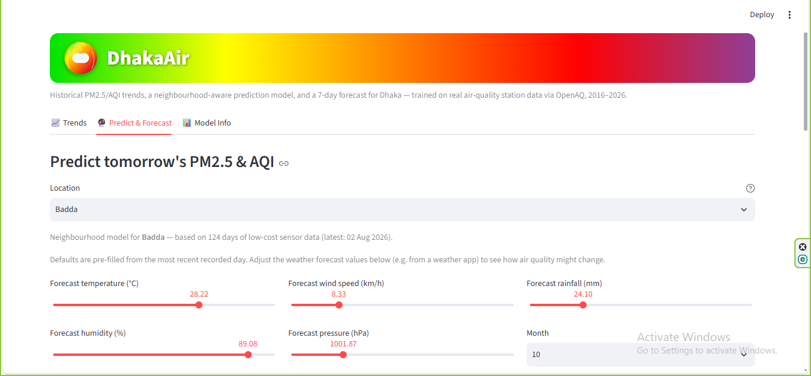
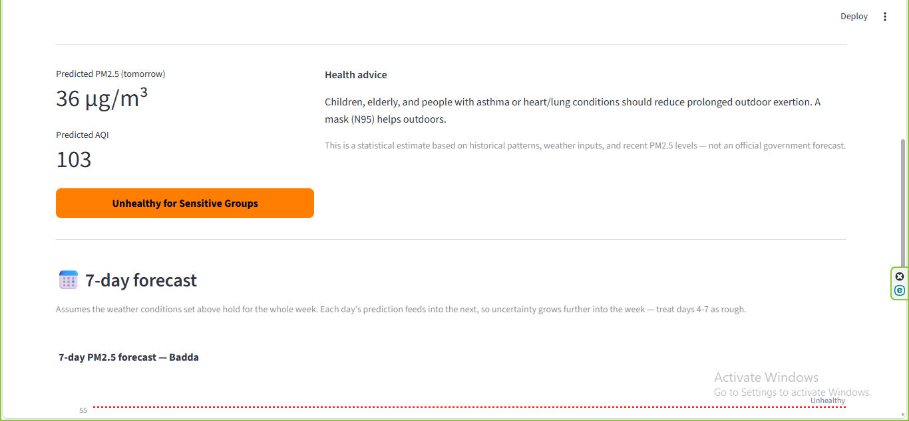
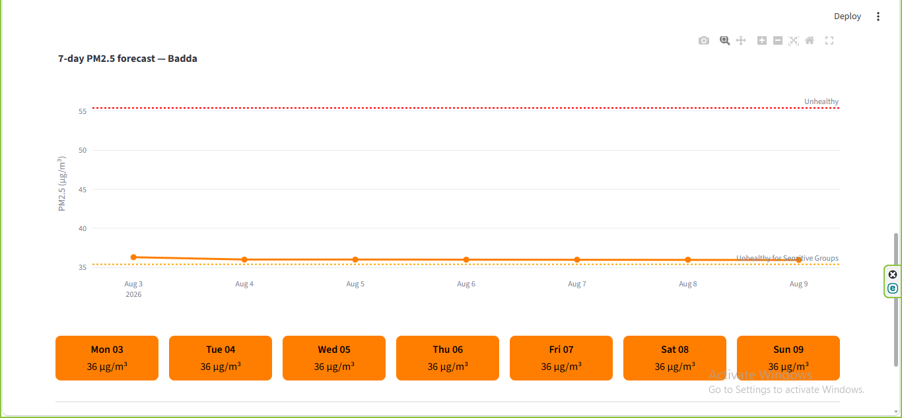

<p align="center"></p>

# DhakaAir — PM2.5/AQI Trend & Prediction Dashboard

A dashboard that shows historical PM2.5/AQI trends for Dhaka and **predicts tomorrow's
air quality** using a trained machine learning model — not just heuristics.

**🔗 Live demo:** _add your Streamlit link here after deploying_

## 🖼️ Features

- **Trend explorer** — daily PM2.5 chart, monthly and seasonal averages, filterable by year/season
- **Location-aware next-day prediction** — pick "Dhaka Average" (10-year city-wide model) or one
  of 7 neighbourhoods (Uttara, Baridhara, Dhanmondi, Gulshan, Badda, Ramna, Hazaribagh)
- **7-day forecast** — recursive day-by-day PM2.5/AQI forecast for the selected location
- **Health advice** — AQI category (Good → Hazardous) with matching guidance
- **Model transparency** — MAE/R², a head-to-head comparison of Linear Regression / Random Forest /
  Gradient Boosting vs. a naive baseline, and feature importance, all shown in-app

## 🖼️ Screenshots

**Location-aware prediction — choose a neighbourhood and forecast inputs**


**Prediction result with health advice**


**7-day PM2.5 forecast chart**


## 📊 Data & Models

Two models, trained on two different OpenAQ data sources:

**City-wide model (10-year history)**
- **Source:** US Embassy Dhaka reference-grade station, Baridhara (daily, 2016–2025, ~2,750 days)
- **Model:** Linear Regression (scikit-learn) — selected because it beat Random Forest and
  Gradient Boosting on held-out data; see the in-app model comparison
- **Evaluation:** chronological train/test split (no shuffling) — **MAE ≈ 20 µg/m³, R² ≈ 0.83**,
  vs. a naive "tomorrow = 7-day average" baseline (MAE ≈ 23, R² ≈ 0.78)

**Neighbourhood model (location-aware)**
- **Source:** low-cost sensor network across 7 Dhaka areas (Uttara, Baridhara, Dhanmondi,
  Gulshan, Badda, Ramna, Hazaribagh), 6–12 months of daily data each
- **Model:** Random Forest, with neighbourhood as a feature — **MAE ≈ 6 µg/m³, R² ≈ 0.15**
- **Honest limitation:** with under a year of history per station, this model is close to a
  naive "tomorrow = today" guess. It's included to make the location-specific feature usable,
  but needs 1-2 more seasonal cycles of data before it's reliable

## ⚙️ How It Works

| Step | Technique |
|------|-----------|
| Data cleaning | pandas — chronological sort, drop rows with missing lag/rolling features |
| Feature engineering | lag-1/2/3 PM2.5, 7-day & 30-day rolling means, brick-kiln season flag, weekday/weekend, one-hot neighbourhood |
| Model selection | Linear Regression vs. Random Forest vs. Gradient Boosting, compared on the same chronological split — best one kept |
| 7-day forecast | recursive prediction: each day's output becomes the next day's lag feature, rolling means updated in sequence |
| Serving | models + feature lists pickled with `joblib`, loaded once and cached in Streamlit |

## 🚀 Getting Started

```bash
git clone https://github.com/<your-username>/dhakaair.git
cd dhakaair
pip install -r requirements.txt
streamlit run app.py
```

Then open `http://localhost:8501` in your browser.

## 📁 Project Structure

```
dhakaair/
├── app.py                    # Main Streamlit dashboard
├── requirements.txt          # Python dependencies
├── model_final.pkl           # City-wide model (Linear Regression)
├── features_final.pkl        # Feature list for the city-wide model
├── metrics.pkl                # City-wide model evaluation metrics
├── model_location.pkl        # Neighbourhood-aware model (Random Forest)
├── location_features.pkl     # Feature list for the neighbourhood model
├── location_areas.pkl        # List of supported neighbourhoods
├── location_metrics.pkl      # Neighbourhood model evaluation metrics
├── model_comparison.pkl      # MAE/R² for Linear Regression / RF / GB / baseline
├── app_data.csv              # Cleaned city-wide daily data used for charts
├── area_history.csv          # Per-neighbourhood daily history (for predictions/forecast)
└── README.md
```

## 🔬 Limitations & Roadmap

- The neighbourhood model has under a year of data per station — more seasons of data
  needed before it reliably beats a naive baseline (see Model Info tab for the honest numbers)
- The city-wide model is trained on a **single station** (Baridhara, a diplomatic-zone
  location), so it may not reflect industrial or high-traffic neighbourhoods as accurately
- The 7-day forecast assumes constant weather for the whole week — a real forecast API
  (e.g. Open-Meteo) would make days 4-7 meaningfully more accurate
- Doesn't account for one-off events (fires, dust storms, festivals/fireworks)
- **Next steps:** connect a live weather forecast API for the 7-day view, add Mirpur once it
  has enough history, and compare against a dedicated time-series model (e.g. Prophet or LSTM)

## 📄 License

MIT — free to use and modify.
